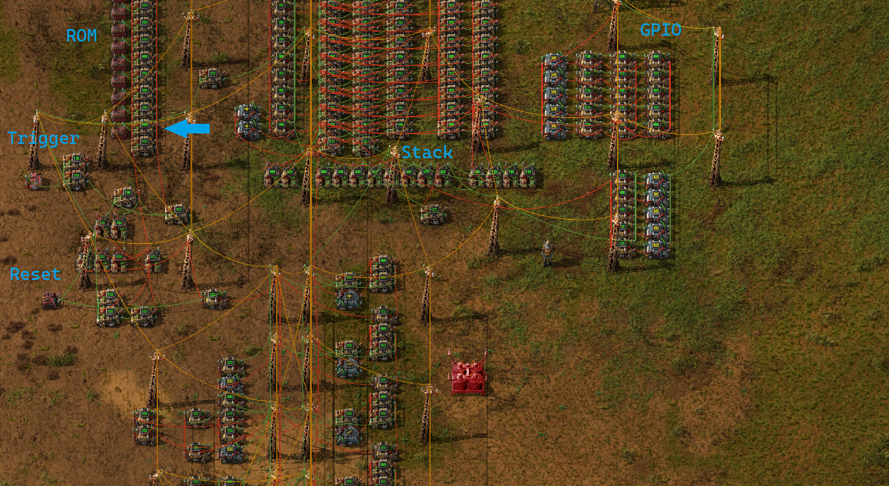

# Laurie's Factorio Computer

This repository contains a blueprint for a computer built in Factorio using combinators (the LFC), as well as a compiler/assembler that can generate a blueprint containing the program rom for the computer.

## Computer Architecture
### Stack
There is only one form of working memory in the LFC: a stack containing signed 32 bit integer values. The stack has a capacity of 32 values, and all instructions read from/write to the stack.

Each value in the stack is assigned an address, with `1` being the top value on the stack.

### Program ROM
The program ROM is indexed with `1` being the first instruction.
Jumping to any address outside of the ROM results in the program halting.

The ROM can be overwritten by placing a ROM blueprint with the bottom-most combinator in the position indicated by the blue arrow in the diagram below.

### Controlling Execution

- To begin execution, enable the "trigger" combinator.
- To halt execution and clear all memory, enable the "reset" combinator (restarting execution will require toggling the "trigger" combinator again).

### GPIO
By connecting large power pole in the blueprint, the signals 1-5 can be accessed by the computer.
The addresses `-1` to `-5` inclusive are used to write to (red) signals 1-5,
and addresses `-6` to `-10` inclusive are used to read from (green) signals 1-5.


[Blueprint String](blueprint.txt)


### Machine Code

Each instruction has an opcode, indicated with the `O` signal. Instruction arguments are stored in the `D` signal for constant values, or in the `A` signal for a stack address or program memory address.
Here are all of the instructions sorted by opcode:

Register `A` denotes the top value on the stack, register `B` denotes the value with address 2.

1: `JUMP <address>`: Unconditional jump to `address`.

2: `JMPIF <address>`: Pops a value from the stack. If it is non-zero, jumps to `address`, otherwise continues from the next instruction.

3: `SAVE <address>`: Reads the top value from the stack, saves it to `address`, then pops the value just read.

4: `LOAD <address>`: Reads the stack value `address` and then pushes it to the stack.

5: `CNST <value>`: Pushes `value` to the stack.

Binary operations are carried out upon A and B, then pop both values from the stack and push the result:

6: `ADD`: `a + b`

7: `SUB`: `a - b`

8: `DIV`: `a / b` (floor division)

9: `MUL`: `a * b`

10: `POW`: `a` to the power of `b`

11: `REM`: `a % b`

12: `SHL`: `a << b`

13: `SHR`: `a >> b`

14: `AND`: `a AND b`

15: `OR`: `a OR b`

16: `XOR`: `a XOR b`

17: `NOT`: Unary operator. Calculates `NOT A` then pushes the result.

Conditional operators push 1 if `true`, 0 if `false`:

18: `EQ`: Pushes 1 if `A == B`, 0 otherwise.

19: `NE`: `a != b`

20: `GT`: `a > b`

21: `LT`: `a < b`

22: `GTE`: `a >= b`

23: `LTE`: `a <= b`

24: `POP`: Removes the top value from the stack

25: `JMPNIF <address>`: Pops a value from the stack. If it is **zero**, jumps to `address`, otherwise continues from the next instruction.

26: `JSR <address>`: Pushes the address of the next instruction to the stack, then jumps to `address`.

27: `RET`: Pops the return address from the stack, then jumps to that address.

## Compiler

To write code for the computer, I have created a compiler that works with a simple C-like language, I've called LFL (laurie's factorio language).

### Usage
To compile a program into a blueprint string containing the program ROM (written to stdout), execute:

`lflc <path>.lfl`

To view the compiled code, pass also the `--assembly` argument.


### Language "Specification"
The following is a (not particularly precise) specification of the language syntax.
Semantics etc. are not specified as I'm running out of time to finish this project.

A program in LFL is made up of any number of functions.

#### Functions
Each function is declared as follows:

```
<return type> <name>(<args>) { 
    <block>
}
```

Where `<return type>` is either `int` or `void`, `<name>` is an identifier, and `<args>` is a comma separated list of identifiers with no trailing commas.

(An identifier consists of the characters a-z, A-Z, digits 0-9, and `_ but cannot start with a digit)

A `<block>` consists of any number of statements. If the return type is `int`, the function must terminate with a `return <expression>;` statement.

Function overloading is not supported. `<name>` must be unique for each function.

#### Statements

- Assignment: `<variable name> = <value expression>;`

- In-place operation: `<variable name> $= <value expression>;`
Where $ is one of the following operators: `+`, `-`, `*`, `/`, `&`, `|`, `^`.

- A function call.

- If statement:

An if statement begins with:
```
if <condition expression> {
    <block>
}
```
Then optionally contains any number of `else if` blocks:
```
else if <condition expression> {
    <block>
}
```
Then optionally an `else` block:
```
else {
    <block>
}
```

- While loop:
```
while <condition expression> {
    <block>
}
```

- Return (only allowed in a `void` function): `return;`
- Return a value (only allowed in an `int` function): `return <expression>;`
- Continue (only allowed in a `while` loop): `continue;`
- Break (only allowed in a `while` loop): `break;`

#### Expressions

An expression consists of the following components, where `<binary operator> <unary expression>`  is optional and can be repeated any number of times:

`<unary expression> <binary operator> <unary expression>`.

##### Binary operators
(LHS = left hand side, RHS = right hand side)
- `+`: Sum of LHS and RHS.
- `-`: Subtracts RHS from LHS.
- `*`: Multiplies LHS by RHS.
- `/`: Divides LHS by RHS (floor division).
- `%`: Calculates the remainder when dividing LHS by RHS.
- `^`: Computes LHS to the power of RHS.
- `<<`: Shifts LHS left by RHS bits.
- `>>`: Shifts LHS right by RHS bits.
- `==`: 1 if LHS equals RHS, 0 otherwise.
- `!=`: 1 if LHS does not equal RHS, 0 otherwise.
- `>`: 1 is LHS is greater than LHS, 0 otherwise.
- `>=`: 1 is LHS is greater than or equal to LHS, 0 otherwise.
- `<`: 1 is LHS is less than LHS, 0 otherwise.
- `<=`: 1 is LHS is less than or equal to LHS, 0 otherwise.
- `&`: Logical AND of LHS and RHS.
- `|`: Logical OR of LHS and RHS.


##### Precedence
In the case of multiple binary operators in one expression, the following order of operations is used.
Each line denotes operators with equal priority that will be evaluated from left to right. Operators with greater priority are in the earlier lines.

1. `^`, `<<`, `>>`
2. `*`, `/`, `%`
3. `+`, `-`
4. `!=`, `==`, `>`, `>=`, `<`, `<=`
5. `&`, `|`

#### Unary expressions

A unary expression can be either:
- `(<expression>)`: an expression in brackets.
- `<unary operator> <expression>`
- `<variable identifier>`: the value of a variable.
- `<number>`: An integer literal, in base 10.
- `<function call>`: A call to a function that does not return `void`.

##### Unary operators:
- `~`: Logical NOT.
- `-`: Negation, returns the negative of the operand.

#### Calls

A function call consists of the following parts:
```
<function identifier>(<arguments>)
```
Where `<function identifier>` is the name of the function and `<arguments>` is a comma separated list of expressions, with no trailing comma. The length of `<arguments>` must match the number of arguments within the function.

#### Accessing GPIO
The variables with identifiers `signal_1` through to `signal_5` inclusive can be used to access the GPIO of the computer. 

### Examples

Finding the number of prime numbers less than an integer:
```c
prime_count = 0;

n = 2;
while n < signal_2 {
    i = 2;
    factors = 0;
    while i < n & factors == 0 {
        if n % i == 0 {
            factors += 1;
        }

        i += 1;
    }

    if factors == 0 {
        prime_count += 1;
    }

    n += 1;
}

signal_1 = prime_count;
```

